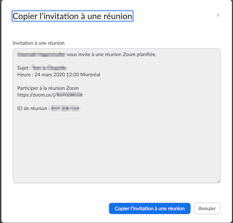
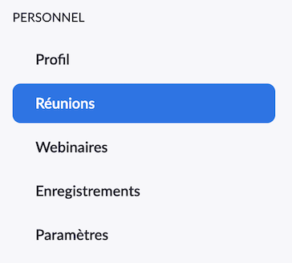

# Utiliser Zoom pour faire des réunions à distance

Les instructions suivantes ont pour but d'aider les personnes impliquées à [la Chapelle](https://lachapelle.me),
qu'elles soient employées ou bénévoles, à continuer à avoir des réunions alors que les [bureaux de la Chapelle](https://www.google.ca/maps/place/160+Rue+Saint+Viateur+E,+Montr%C3%A9al,+QC+H2T+1A8/@45.5271082,-73.5969822,17z/data=!3m1!4b1!4m2!3m1!1s0x4cc9197c865d6d4b:0xfc160a07738250da)
sont fermés suite aux mesures prises par le gouvernement du Québec en lien avec la COVID-19 ([fermeture de tous les services et activités commerciales non prioritaires](https://www.quebec.ca/sante/problemes-de-sante/a-z/coronavirus-2019/fermeture-endroits-publics-commerces-services-covid19/)).

Dans l'urgence de la situation, l'équipe IT de [la Chapelle](https://lachapelle.me), constituée essentiellement de
bénévoles, a testé différentes solutions pour des réunions à distance et recommande [Zoom](https://zoom.us) pour les
raisons suivantes :
1. très bonne qualité vidéo et audio
2. les participants n'ont pas besoin de compte Zoom, seul(e) l'organisateur(-trice) de la réunion en a besoin d'un
3. première utilisation (et suivantes) facile par un simple clic sur un lien
4. nombre illimité de réunions à 2 personnes même avec la version gratuite
5. jusqu'à 100 participants par réunion (mais réunion limitée à 40 min avec la version gratuite ;
   voir [Inviter à une nouvelle réunion](#inviter-à-une-nouvelle-réunion) pour quelques astuces)
6. partage d'écran
7. arrière plan virtuel (pour cacher ce qui se passe derrière soi)
8. des fonctionnalités très intéressantes avec la version payante

Bien qu'initialement dédiées aux personnes impliquées à [la Chapelle](https://lachapelle.me), nous espérons que ces 
instructions pourront aider d'autres personnes. Les contributions pour améliorer ces instructions sont les bienvenues.

---

1. [Être prêt à utiliser un compte Zoom pour la première fois](./configuration/README.md) - _Requis pour l'organisateur, pas pour les participants_
   - [Créer un compte Zoom (gratuit)](./configuration/README.md#créer-un-compte-zoom-gratuit)
   - [Paramètres de compte recommandés](./configuration/README.md#paramètres-de-compte-recommandés)
   - [Installer les applications Zoom](./configuration/README.md#installer-les-applications-zoom)
   - [Se connecter sur le site de Zoom](./configuration/README.md#se-connecter-sur-le-site-de-zoom)
2. [Inviter à une nouvelle réunion](#inviter-à-une-nouvelle-réunion)
   - [Créer la réunion dans Zoom](#créer-la-réunion-dans-zoom)
   - [Inviter à la réunion](#inviter-à-la-réunion)
   - [Démarrer la réunion](#démarrer-la-réunion)

---

## Inviter à une nouvelle réunion

Si c'est la **première fois que vous plannifiez une réunion avec Zoom, prévoyez au moins 15-30 min avant que la réunion
commence** afin d'avoir le temps de suivre les instructions de [Être prêt à utiliser un compte Zoom pour la première fois](./configuration/README.md) 
et que vos participants puissent être prêts à temps aussi.

### Créer la réunion dans Zoom

_Il s'agit ici de créer la réunion depuis le site de Zoom depuis son ordinateur mais les étapes sont similaires depuis
les applications Zoom._

1. [Se connecter sur le site de Zoom](./configuration/README.md#se-connecter-sur-le-site-de-zoom) si pas déjà connecté
2. Cliquer en haut à droite sur `PROGRAMMER UNE RÉUNION`  
   
3. Saisir le `Sujet`, `Quand` la réunion est prévue et sa `Durée`

Avec un compte Zoom BASIQUE (type de votre compte quand vous le créez et jusqu'à ce que vous décidiez de payer pour
des fonctionnalités supplémentaires; il s'agit d'un compte gratuit), les réunions de plus de 2 participants au total
sont coupées au bout de 40 min, néanmoins vous pouvez faire la chose suivante :
1. Mettre une `Durée` de plus de 40 min
2. Prévenir les participants qu'au bout d'environ 40 min, la réunion sera brutalement coupée et leur dire de rejoindre
   alors la même réunion en réutilisant le même lien
3. Quand la réunion est coupée au bout d'environ 40 min, rejoindre la réunion en réutilisant le même lien

Finalement :
1. Cliquer en bas de la page sur le bouton `Enregistrer`
2. Sur la page de la réunion, cliquer complétement à droite de `URL pour se joindre` sur `Copier l'invitation`  
   
3. Cliquer sur le bouton `Copier l'invitation à une réunion`  
   
4. [Inviter à la réunion](#inviter-à-la-réunion)

_La vidéo suivante créée par Zoom en 2016 pourrait aussi vous être utile pour programmer des réunions :
[Comment programmer des réunions ?](https://support.zoom.us/hc/fr/articles/201362413-How-Do-I-Schedule-Meetings-?zcid=1588)_

### Inviter à la réunion

Afin de pouvoir inviter à une réunion, il faut d'abord [Créer la réunion dans Zoom](#créer-la-réunion-dans-zoom).
A la fin de [Créer la réunion dans Zoom](#créer-la-réunion-dans-zoom) vous avez l'invitation dans le presse-papier de
votre ordinateur, il ne vous reste plus qu'à :

1. Envoyer l'invitation aux participants
2. Avec l'invitation, si les participants n'ont pas encore l'habitude des réunions Zoom :
   - leur conseiller d'installer l'application Zoom avant la réunion même si un clic sur le lien de la réunion s'en
   chargerait pour eux car cela permmettra de commencer à l'heure ; voir [Installer les applications Zoom](./configuration/README.md#installer-les-applications-zoom)
   - s'assurer qu'ils aient au moins un micro et des enceintes ou un casque pour la réunion ;
   bien sûr une caméra serait encore mieux
   - les prévenir qu'au bout de 40 min il faudra rejoindre la réunion (dans le cas où vous avez prévu une réunion de plus
   de 40 min avec au moins 2 autres personnes)

Un exemple d'email d'invitation pourrait être :

```
Bonjour,

Je t'invite à une réunion Zoom et avant que nous puissions la commencer pourrais-tu stp t'assurer que tu aies le nécesaire ?

Tu auras besoin soit d'un ordinateur avec une connexion Internet, soit d'un smartphone avec une connexion Internet.
Tu auras aussi besoin d'au moins d'un micro et d'enceintes (ou haut parleur ou casque) pour pouvoir parler durant la réunion et être entendu.
Idéalement, une caméra aussi pour être vu.

!!! ATTENTION !!!, après 40 minutes la réunion va couper brutalement. Tu n'auras qu'à rejoindre la réunion à nouveau en cliquant sur le lien de la réunion mis plus bas dans l'email.
Je ferai de même.

Voici les instructions si c'est la première fois que tu utilises Zoom :

   - *méthode recommandée* : par l'application Zoom sur ton ordinateur
      1. télécharge et installe l'application (tu n'as pas besoin de créer un compte Zoom pour télécharger ou même après) : https://zoom.us/download#client_4meeting
      2. quand il sera l'heure de la réunion, clique sur le lien de la réunion mis plus bas dans l'email
   - ou par l'application mobile :
      1. télécharge et installe la (tu n'as pas besoin de créer un compte Zoom pour télécharger ou même après) : https://zoom.us/download#mobile_app
      2. quand il sera l'heure de la réunion, clique sur le lien de la réunion mis plus bas dans l'email

   En joignant depuis l'app (ordinateur ou mobile), assure-toi bien d'activer ton micro (et ta caméra) une fois que tu joins la réunion
   (sur mobile il faut cliquer sur l'icône en bas à gauche et bien suivre les instructions). Ce n'est pas fait automatiquement.

Si tu rencontres un quelconque problème n'hésites pas à me contacter au <Remplacez ici par votre Numéro de téléphone>.

<Remplacez ici par votre Prénom>

---

<Mettre ici l'invitation de la réunion copiée depuis le site Zoom>

```

Cet exemple est très générique, vous n'avez qu'à le copier et mettre les bonnes valeurs à la place de :
- `<Remplacez ici par votre Numéro de téléphone>`
- `<Remplacez ici par votre Prénom>`
- `<Mettre ici l'invitation de la réunion copiée depuis le site Zoom>`

## Démarrer la réunion

**!!! Rappel !!!**  
Si c'est la première fois que vous plannifiez une réunion avec Zoom, prévoyez au moins 15-30 min avant que la réunion
commence afin d'avoir le temps de suivre les instructions de [Être prêt à utiliser un compte Zoom pour la première fois](./configuration/README.md).

Afin de pouvoir inviter à une réunion, il faut d'abord [Créer la réunion dans Zoom](#créer-la-réunion-dans-zoom).

_Il s'agit ici de démarrer la réunion depuis le site de Zoom depuis son ordinateur mais les étapes sont similaires depuis
les applications Zoom._

1. [Se connecter sur le site de Zoom](./configuration/README.md#se-connecter-sur-le-site-de-zoom) si pas déjà connecté
2. Dans le menu de gauche, cliquer sur `Réunions`  
   
3. A droite de la réunion à démarrer, cliquer sur le bouton `Commencer`  
   
4. Accepter d'ouvrir le lien dans l'application Zoom quand cela est demandé
5. Une fois dans l'application Zoom, cliquer sur le bouton invitant à joindre avec l'audio de l'ordinateur
6. En bas à gauche dans l'application, activer son micro et sa caméra

Bonne réunion !

Si la réunion coupe brutalement (par exemple au bout de 40 min dans le cas d'un compte Zoom BASIQUE), recommencer les
étapes ci-dessus.

A la fin de la réunion :
1. Cliquer dans l'application, en bas à droite sur `Finir la Réunion`
2. La finir pour tous les participants
