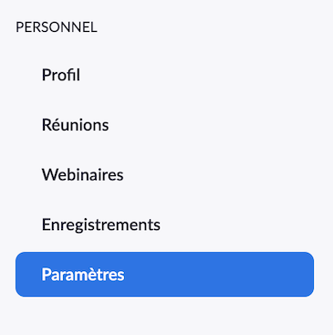

# Être prêt à utiliser un compte Zoom pour la première fois

Ce document fait partie d'un ensemble d'instructions. Merci de bien vouloir lire l'en-tête de [../README.md](../README.md)
avant de poursuivre avec la lecture ce document.

---

1. [Créer un compte Zoom (gratuit)](#créer-un-compte-zoom-gratuit)
2. [Paramètres de compte recommandés](#paramètres-de-compte-recommandés)
3. [Installer les applications Zoom](#installer-les-applications-zoom)
4. [Se connecter sur le site de Zoom](#se-connecter-sur-le-site-de-zoom)

---

## Créer un compte Zoom (gratuit)

La création d'un compte Zoom est similaire à la création de comptes pour d'autres services Internet. Elle ne nécessite
que d'**une adresse courriel valide** et il suffit de suivre les étapes décrites sur <https://zoom.us>.

Si vous n'avez pas trop l'habitude de créer des comptes sur Internet, vous pouvez suivre les étapes suivantes :

1. Aller sur <https://zoom.us>
2. Mettre le site en Français s'il ne l'est pas encore
   - se rendre tout en bas de la page et sélectionner `Français` dans la liste déroulante `Language`  
   
   - la page est automatiquement rafraîchie et le site est désormais en français
3. Cliquer en haut à droite sur `INSCRIVEZ-VOUS, C'EST GRATUIT`  
   
4. Entrer son adresse email (ou opter pour se connecter avec Google ou Facebook; étapes non détaillées ici)  
   
5. Après avoir lu la _Politique de confidentialité_ et les _Conditions de Service_ (les 2 liens en dessous du bouton
   _S'inscrire_), cliquer sur `S'inscrire`
6. Aller vérifier ses courriels (aussi dans les courriers indésirables si besoin) et cliquer sur `Activation du compte`
   dans le courriel envoyé par `Zoom` normalement intitulé `Veuillez réactiver votre compte Zoom`  
   
7. Saisir ses `Prénom`, `Nom de famille`, `Mot de passe` et `Confirmer le mot de passe`  
   
8. Cliquer sur `Continuer`
9. L'étape `Inviter des collègues` peut être sautée en cliquant sur le bouton en bas à droite `Sauter cette étape`  
   <!---->
10. Cliquer sur le bouton en bas à droite `Aller à Mon compte`

## Paramètres de compte recommandés

A la fin des étapes de [Créer un compte Zoom](#créer-un-compte-zoom-gratuit), vous aboutissez sur la page de votre
compte Zoom.  
Vous pouvez aussi directement vous y rendre en allant sur <https://zoom.us/profile>.

Si vous n'êtes pas connecté, suivre les étapes de [Se connecter sur le site de Zoom](#se-connecter-sur-le-site-de-zoom).

Ces paramètres sont ceux que l'équipe IT de [la Chapelle](https://lachapelle.me) conseille pour le type de compte BASIQUE
de Zoom (type de votre compte quand vous le créez et jusqu'à ce que vous décidiez de payer pour des fonctionnalités
supplémentaires; il s'agit d'un compte gratuit).
Les paramètres pour lesquels **Activer** est en **gras**, dans la liste ci-dessous, devraient déjà être activés
et non modifiables.

1. Saisir les informations de `Date et heure`  
     
   Ne pas oublier de cliquer sur `Enregistrer les modifications`
2. Dans le menu de gauche, cliquer sur `Paramètres`  
   
3. Activer `Accès à la réunion avant l’arrivée de l’animateur` 
4. **Activer** `Demander un mot de passe lors de la planification de nouvelles réunions` 
5. **Activer** `Demander un mot de passe pour les réunions instantanées` 
6. **Activer** `Demander un mot de passe pour l'ID de réunion personnelle (PMI)`   
   Sélectionner `Toutes les réunions utilisant un PMI` et enregistrer le choix
7. Activer `Intégrez le mot de passe dans le lien de la réunion pour rejoindre en un clic` 
8. **Activer** `Exiger un mot de passe pour les participants qui se joignent par téléphone` 
9. Activer `Rappel d’une réunion prochaine` 
10. Désactiver `Discussion privée` 
11. Activer `Conversations enregistrées automatiquement` 
12. Désactiver `Transfert de fichier` 
13. Activer `Jouer l’audio lorsque des participants rejoignent ou quittent` 
14. Activer `Toujours afficher la barre d’outils du contrôle des réunions` 
15. Désactiver `Salle d'attente` 
16. Désactiver `Autoriser les participants retirés à rejoindre` 
17. Activer `Afficher un lien « Rejoindre depuis votre navigateur »` même si l'expérience n'est pas terrible, au cas où
    un des participants ne puisse pas télécharger l'application 

## Installer les applications Zoom

**Avant de continuer, veuillez svp vous assurer d'avoir lu la section [ACTIONS REQUISES] en en-tête de [../README.md](../README.md).**

Bien que les réunions par le biais de Zoom peuvent avoir lieu directement depuis le navigateur Internet, il est
recommandé par Zoom d'utiliser plutôt les applications dédiées.

L'équipe IT de [la Chapelle](https://lachapelle.me) recommande aussi d'utiliser l'application sur ordinateur plutôt que
sur smartphone car elle est mieux pour voir tous les participants en même temps.

Pour les télécharger :
- application Windows/MacOS : depuis son ordinateur, cliquer sur `Télécharger` depuis <https://zoom.us/download#client_4meeting>  
  Windows : `Version 4.6.9 (19253.0401) (du 2 avril 2020)` ou supérieure  
  MacOS : `Version 4.6.9 (19273.0402) (du 2 avril 2020)` ou supérieure
- application iOS : depuis son smartphone, cliquer sur  depuis <https://zoom.us/download#mobile_app>  
  `Version 4.6.9 (19213.0327) (du 27 mars 2020)` ou supérieure
- application Androïd : depuis son smartphone, cliquer sur  depuis <https://zoom.us/download#mobile_app>  
  `Version 4.6.8 (19194.0323) (du 24 mars 2020)` ou supérieure

## Se connecter sur le site de Zoom

1. Depuis son ordinateur, aller sur <https://zoom.us/profile>
2. Saissir son `Adresse e-mail` et son `Mot de passe` puis cliquer `Connexion`  
   (ou se connecter avec Google ou Facebook dépendamment de comment le compte a été créé)  
   
